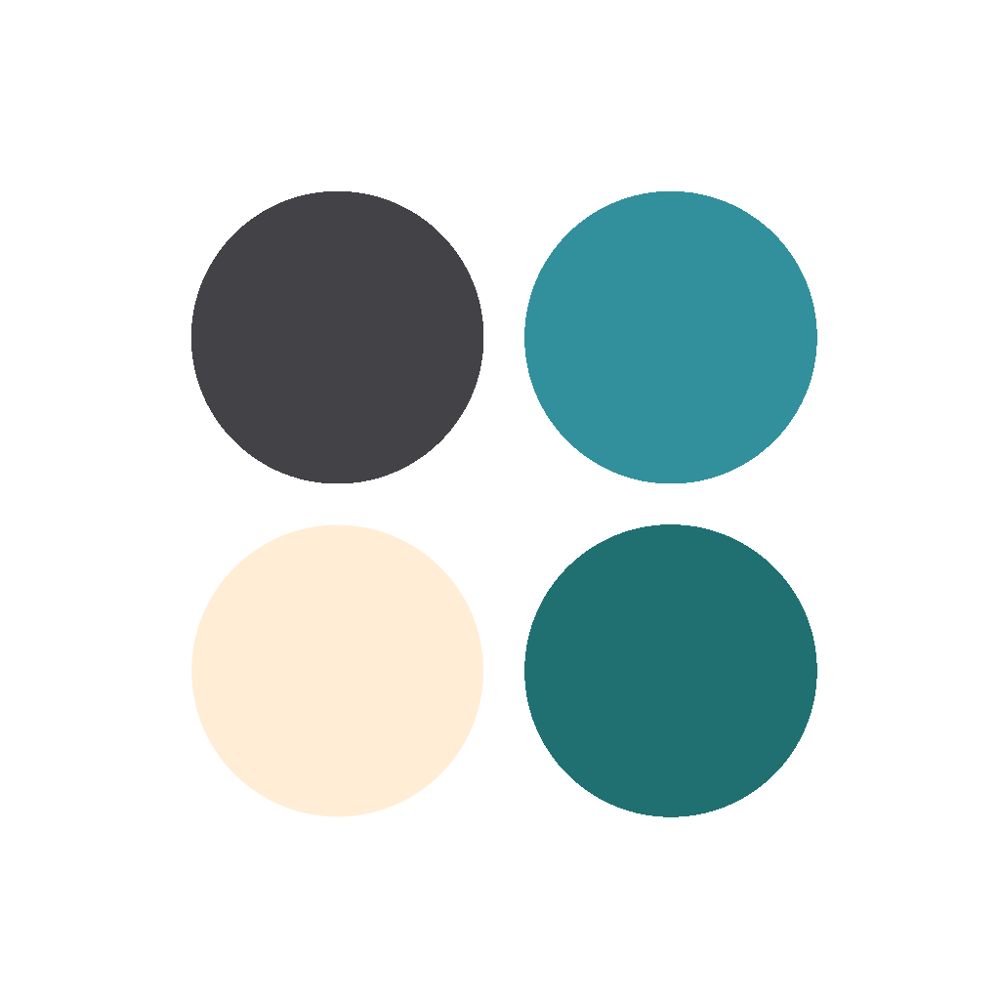

## Moody<p align="center">

  

  <h3 align="center">Moody</h3>
  <p align="center">Track your moods, find your balance with Moody.</p>
</p>

# Moody

Moody is a powerful platform designed to help people track and manage their mental health. By providing a simple and intuitive interface, Moody allows users to easily log their daily moods and emotions, and track how they change over time. With features like personalized recommendations and community support, Moody helps users take charge of their mental well-being and stay on top of their emotional health. Whether you're struggling with depression, anxiety, or just looking to better understand your emotions,

As an MVP developed for the first sprint of PUC-Rio's Post Graduation Course in Software Engineering, this product currently offers only basic functionalities.

## Moody Client

This repository contains all the necessary files to run the Client project that powers the Moody platform. This application was built on top of React. If you want take a look at the server application, check the Moody Server repository. https://github.com/imdiegolopes/moody-server

## Prerequisites

Before running the project, you need to have the following prerequisites installed on your system:

- NodeJS
- NPM or Yarn

To install all dependencies within the package.json file, use the following command:

```bash
yarn install
```

To run the project and bootstrap the server on localhost on port 5173, use the following command:

```bash
yarn dev
```
